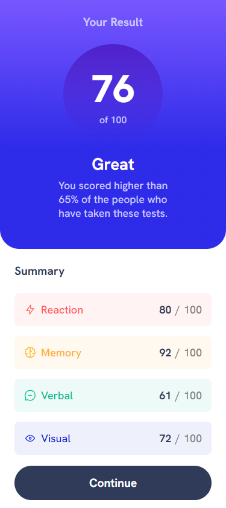
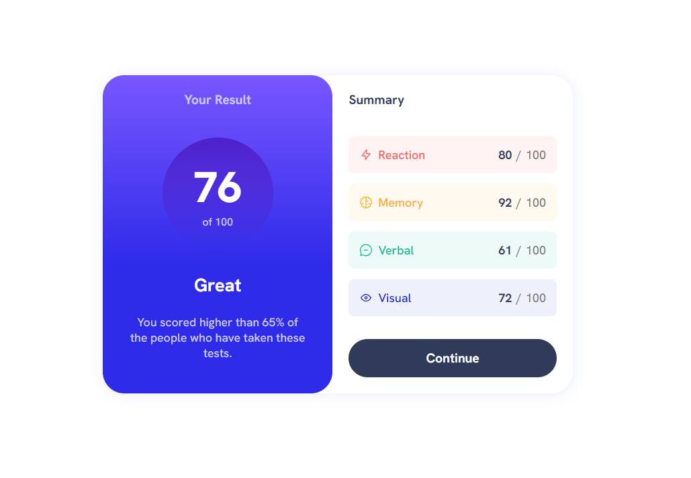

# Frontend Mentor - Results summary component solution

This is a solution to the [Results summary component challenge on Frontend Mentor](https://www.frontendmentor.io/challenges/results-summary-component-CE_K6s0maV). Frontend Mentor challenges help you improve your coding skills by building realistic projects. 

## Table of contents

- [Overview](#overview)
  - [The challenge](#the-challenge)
  - [Screenshot](#screenshot)
  - [Links](#links)
- [My process](#my-process)
  - [Built with](#built-with)
  - [What I learned](#what-i-learned)
  - [Continued development](#continued-development)
- [Author](#author)

**Note: Delete this note and update the table of contents based on what sections you keep.**

## Overview

### The challenge

Users should be able to:

- View the optimal layout for the interface depending on their device's screen size
- See hover and focus states for all interactive elements on the page

### Screenshot

Mobile view

Desktop view

### Links

- [Solution URL](https://github.com/mrf1989/results-summary-component)
- [Live Site URL](https://mrf1989.github.io/results-summary-component/)

## My process

### Built with

- Semantic HTML5 markup
- CSS custom properties
- Flexbox
- Mobile-first workflow

### What I learned

I have reviewed my knowledge of HTML and CSS. I refreshed my knowledge about media queries and applying styles to child elements. I also reviewed some values for backgrounds such as gradients.

### Continued development

Next challenge - [Order summary component](https://www.frontendmentor.io/challenges/order-summary-component-QlPmajDUj)

## Author

- Frontend Mentor - [@mrf1989](https://www.frontendmentor.io/profile/mrf1989)
- Twitter - [@mruano89](https://www.twitter.com/mruano89)
- LinkedIn - [Profile](https://es.linkedin.com/in/marioruano) 